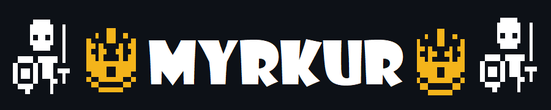
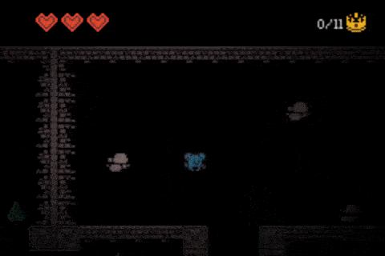

Myrkur is a game in which you, a little powerless blue blob, explore an open world to collect all the crowns left behind in the desolate wastelands of a kingdom long gone by...

This is a game jam entry for the 48h Kenney jam 2023, written in Lua with the Love library, and is hosted on itch.io [here](https://richardbaltrusch.itch.io/myrkur).



## How to run

To run, download lua and the love framework, then run love.exe in the current folder:

```
love .
```

Note: you may have to specify the full path to the love executable if it is not on your path.

## How to package

Detailed packaging instructions for Windows are documented [here](https://love2d.org/wiki/Game_Distribution).

Essentially, select all files required to run the game, zip them, rename .zip to .love, then concatenate it with love.exe and distribute it will all .dll's (including license) found in the love installation folder:

```batch
::zip game code and assets by hand
copy SuperGame.zip SuperGame.love
copy /b love.exe+SuperGame.love SuperGame.exe
::copy dlls into folder
```
